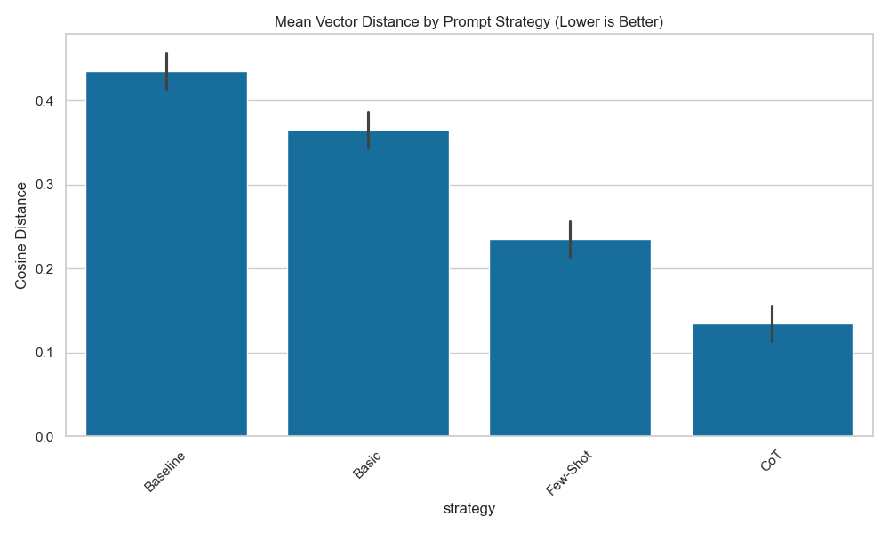

# Prompt Engineering Effectiveness Analysis

## Description
This project analyzes the effectiveness of different prompt engineering techniques (Zero-shot, Few-shot, Chain of Thought) on Logic Puzzles (Syllogisms). It measures performance using vector distances between the model's output and the ground truth.

## Features
- **Dataset Generation**: Creates a dataset of logical syllogisms.
- **Multiple Prompting Strategies**: 
    - Baseline (Zero-shot)
    - Basic Prompt Engineering (System Prompt)
    - Few-Shot Learning
    - Chain of Thought (CoT)
- **Evaluation Metrics**: Uses Sentence Transformers to calculate semantic cosine distance.
- **Visualization**: Generates comparison plots of the effectiveness of each strategy.

## Installation

1. Clone the repository.
2. Create a virtual environment:
   ```bash
   python -m venv .venv
   source .venv/bin/activate
   ```
3. Install dependencies:
   ```bash
   pip install -r requirements.txt
   pip install -e .
   ```
4. Ensure you have [Ollama](https://ollama.com/) installed and running with the `llama3` (or configured) model:
   ```bash
   ollama pull llama3
   ollama serve
   ```

## Configuration
The project is configured via `config/settings.yaml`. You can copy `config/settings.yaml.example` to start.

| Parameter | Description | Default |
| :--- | :--- | :--- |
| `llm.model` | The Ollama model to use | `llama3` |
| `experiment.dataset_size` | Number of puzzles to generate | `10` |
| `experiment.embedding_model` | HuggingFace model for metrics | `all-MiniLM-L6-v2` |

See [config/settings.yaml.example](config/settings.yaml.example) for a full example.

## Usage
Run the main experiment script:
```bash
python src/main.py
```
Results will be saved in `results/experiment_results.csv` and figures in `results/figures/`.

## Screenshots

### CLI Interface
```text
Starting Prompt Engineering Analysis Project

Available Models:
1. llama3
2. mistral

Select a model (1-2) [default: llama3]: 1
Selected model: llama3
Running strategy: Baseline (Zero-Shot)
...
```

### Results Visualization


## Interactive Dashboard
You can explore the results interactively using the Streamlit dashboard:
```bash
streamlit run src/dashboard.py
```

## Extensibility
You can easily add new strategies or metrics. See [docs/EXTENSIBILITY.md](docs/EXTENSIBILITY.md) for details.

## Troubleshooting

-   **Ollama Connection Error**: Ensure Ollama is running (`ollama serve`). Check if `http://localhost:11434` is accessible.
-   **Model Not Found**: Run `ollama pull <model_name>` to download the model specified in config.
-   **Memory Issues**: Reduce `dataset_size` in `config/settings.yaml` or use a smaller embedding model.

## Costs
See [COSTS.md](COSTS.md) for a breakdown of estimated resource usage and costs.

## Contributing
See [CONTRIBUTING.md](CONTRIBUTING.md) for guidelines on code style and testing.

## Testing
Run unit tests with coverage:
```bash
pytest --cov=src tests/
```

## Authors
Code Agent