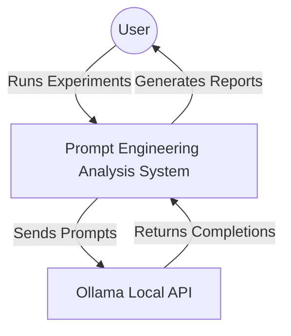
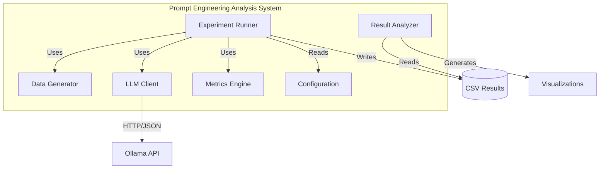

# Architecture Documentation

## System Overview
The system is designed as a modular pipeline for running NLP experiments.

### C4 Context Diagram

### C4 Container Diagram

### Components

1.  **Data Generator (`src/utils/data_generator.py`)**:
    -   Responsible for creating synthetic Logic Puzzles (Syllogisms).
    -   Outputs: JSON structure with Question, Answer, Label.

2.  **Ollama Client (`src/utils/llm_client.py`)**:
    -   Wraps the `ollama` library.
    -   Handles API communication and error logging.

3.  **Metrics Engine (`src/utils/metrics.py`)**:
    -   Uses `sentence-transformers` (Hugging Face) to generate embeddings.
    -   Calculates Cosine Distance (sklearn).

4.  **Experiment Runner (`src/experiment_runner.py`)**:
    -   The core orchestrator.
    -   Iterates through strategies and dataset items.
    -   Collects raw data.

5.  **Analyzer (`src/analysis.py`)**:
    -   Processes raw CSV data.
    -   Generates statistical summaries and Matplotlib/Seaborn figures.

## Data Flow
1.  Generator -> Dataset (List[Dict])
2.  Runner -> Sends Prompt -> Ollama -> Response
3.  Runner -> Response + Ground Truth -> Metrics -> Distance
4.  Runner -> Results (CSV)
5.  Analyzer -> Results (CSV) -> Figures (PNG)

## API / Interface Definitions

### ExperimentRunner
- `run_all_experiments() -> pd.DataFrame`: Orchestrates the execution of all defined strategies against the generated dataset.
- `_strategy_*(item: Dict) -> str`: Internal strategy implementations (Baseline, CoT, etc.).

### OllamaClient
- `generate(prompt: str, system: str = None) -> str`: Sends a request to the configured local model.
- `check_connection() -> bool`: Verifies connectivity to the Ollama service.

### SyllogismGenerator
- `generate_dataset(size: int) -> List[Dict]`: Creates a list of syllogism problems with ground truth.

### SimilarityEvaluator
- `calculate_distance(text1: str, text2: str) -> float`: Computes the cosine distance (0 to 1) between two text strings.

## Design Decisions
-   **Local Embeddings**: We use `all-MiniLM-L6-v2` locally to avoid dependence on external embedding APIs and ensure speed.
-   **Ollama**: Chosen for local LLM inference, ensuring privacy and cost-efficiency.
-   **Config**: Centralized in `config/settings.yaml` for easy tuning without code changes.
